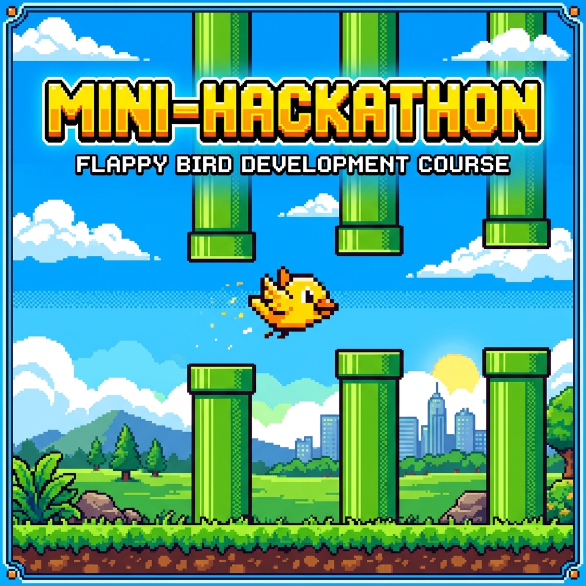

# 🚀 Курс: Создание игры Flappy Bird на SpritePro 

Добро пожаловать в репозиторий 4-дневного мини-хакатона по созданию легендарного хита — **Flappy Bird**! 🎮

## 🏆 О курсе
Этот обучающий мини-курс проведет нас от пустого окна до полноценной и динамичной игры всего за 4 урока! Мы будем использовать современный высокоуровневый 2D-движок — **SpritePro**.

Главная особенность курса — **практика и динамика**. Вместо скучной теории мы сразу "оживляем" графику, работаем с гравитацией, физикой и вводом!

## 🎓 Структура хакатона:

- **Урок 1: База и Первые Прыжки** 🐣
  - Подключение движка (`pip install spritePro`).
  - Система сцен, координаты (`pos` — это центр!).
  - Z-index (сортировка отрисовки).
  - Физика (`s.physics`), границы окна и регистрация прыжка по клику или пробелу.

- **Урок 2: Развиваем Геймплей (Трубы, Счёт и Геймовер)** 🚧
  - Спавнер препятствий: генерация труб через `s.Timer`.
  - Движение труб: создаем иллюзию полета и оптимизируем память (выносим трубы за экраном через `.kill()`).
  - Жизненный цикл игры: обработка столкновений (`collides_with`) и логика перезапуска.

- **Урок 3: Счёт и Спецэффекты (Game Feel)** ✨
  - Подсчет очков (`TextSprite`).
  - Система частиц (`ParticleEmitter`): искры при прыжках птички!
  - Тряска камеры (`shake_camera`) при столкновении.
  - Наклон птички: плавное изменение угла (клюв вверх/вниз) в зависимости от вертикальной скорости.

- **Урок 4: Полировка, Звуки и Финал!** 🏆
  - Сохранение лучшего счёта между запуcками (`s.save_load`).
  - Продвинутые эффекты и Tweens: пульсация текста (`tween_punch_scale`) и затухание птички (`tween_alpha`) при проигрыше.
  - Звуки и фоновая музыка (`s.audio_manager`).
  - Сборка игры в самостоятельный `.exe` файл с помощью **PyInstaller**.

## 🛠️ Что нам понадобится
- Python 3+
- Движок [SpritePro](https://github.com/NeoXider/SpritePro) (`pip install spritePro`)
- `pyinstaller` (для Урока 4)

*Создано специально для быстрых и крутых результатов!*
